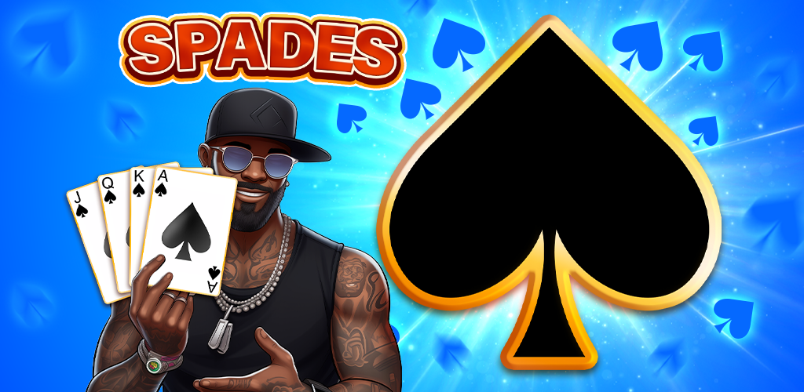

Welcome to the PocketNumbers Studio website!

## Our Titles

### Royal Spades

♠️ Spades is known to be an addictive card game in which players must declare the number of tricks they expect to win in a game. ♠️

Tips & Tricks:
- It’s a standard 52-card pack in which the spades card is always the trump.
- If you’re a beginner, take a look at what your opponents are doing and how they’re bidding.
- Find the Rules in our Spades app settings and read them before starting to select your bid and play.
- Change the cards animation to “slow” from the same app settings, it may help you keep track of your opponents moves more easily.
- Practice makes perfect, so return to this classic Spades app often and keep playing to gain experience and master this online card game like a pro!

Key Features:
1. 100% Free cards game playing online or offline 🤩
2. A trick-taking spades game that’s easy to play and to learn 🤩
3. Learning and testing your classic spades playing skills against skilled AI opponents 🤩
4. Beautiful game themes and card styles that will enhance your spades game experience 🤩
5. Simple, clean and clear, user-friendly interface, a cool online rendering of the tabletop, offline gaming experience 🤩
6. Smooth gameplay, without the useless game add-ons, with no annoying ads - just authentic Spades 🤩
7. The addictive, fun, challenging online card game you’ll want to recur to whenever stress hits 🤩

You can download this game on [Google Play](https://play.google.com/store/apps/details?id=com.pocketnumbers.royalspades)
or [App Store](https://apps.apple.com/us/app/royal-spades-card-game-2024/id6504277218?ls=1) at any time.

Use [this link](https://dmitriifeshchenko.github.io/royal-spades/privacy.html) to review the privacy policy.

* * *

### King of Numbers 2048

Exercise your brain with number block puzzles: merge 2048 bricks and x2 blocks!

How To Play:
- Tap the screen and shoot number blocks in their chronological order of appearance
- Link identical number blocks in a row, vertically or horizontally.
- Gather diamonds and utilize them wisely to progress in the puzzle game.

Key Features:
1. Streamlined and contemporary design, user-friendly interface, and vibrant number blocks ✅
2. Addictive and innovative gameplay ✅
3. Supplementary Tools ✅
4. Leaderboard ✅
5. No time constraints ✅

You can download this game on [Google Play](https://play.google.com/store/apps/details?id=com.pocketnumbers.king.android)
or [App Store](https://apps.apple.com/us/app/king-of-numbers-2048/id6473016871?ls=1) at any time.

Use [this link](https://dmitriifeshchenko.github.io/king-of-numbers/privacy.html) to review the privacy policy.

* * *

### Monster Hunter: Bubble Shooter

Bubble Shooter is a match 3 game with attractive graphics and addictive gameplay

Well-Known Mechanics:
1. Tap to aim and release to shoot the selected bubble 🏹
2. Match 3 or more bubbles to clear them all 💥

Key Features:
1. Really addictive gameplay 🎮
2. Truly useful boosters 🚀
3. Catchy graphics and audio 🙈
4. Lots of levels available 🔥

You can download this game on [Google Play](https://play.google.com/store/apps/details?id=com.dnhnd.monsterhunter) at any time.

Use [this link](https://dmitriifeshchenko.github.io/monsterhunter/privacy.html) to review the privacy policy.

* * *

### Maze puzzle

Improve your visual memory with the classic maze simulator. Find the way out! 🎯

This game is a classic maze simulator that will help to train your visual memory. Moreover, with all the modes available it's very fun to play. You can customize the game as you like more. 🚀

Key Features:
1. Unlimited number of levels
2. Different skins
3. Three types of boosters
4. Four difficulty levels
5. Lot's of different modes

You can download this game on [Google Play](https://play.google.com/store/apps/details?id=com.dnhnd.maze) at any time.

Use [this link](https://dmitriifeshchenko.github.io/maze/privacy.html) to review the privacy policy.

* * *

## Support or Contact

Having trouble with our apps? [contact support](mailto:pocketnumbers.help@gmail.com) and we’ll help you sort it out.
